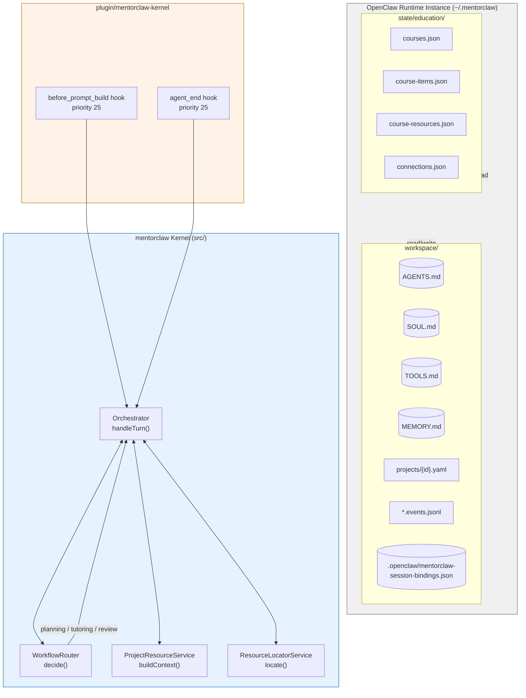
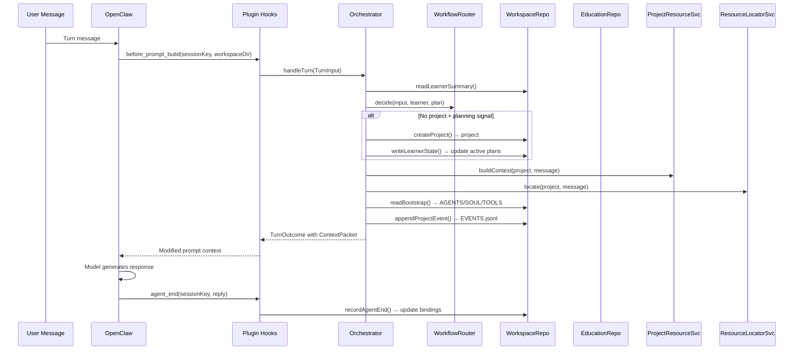
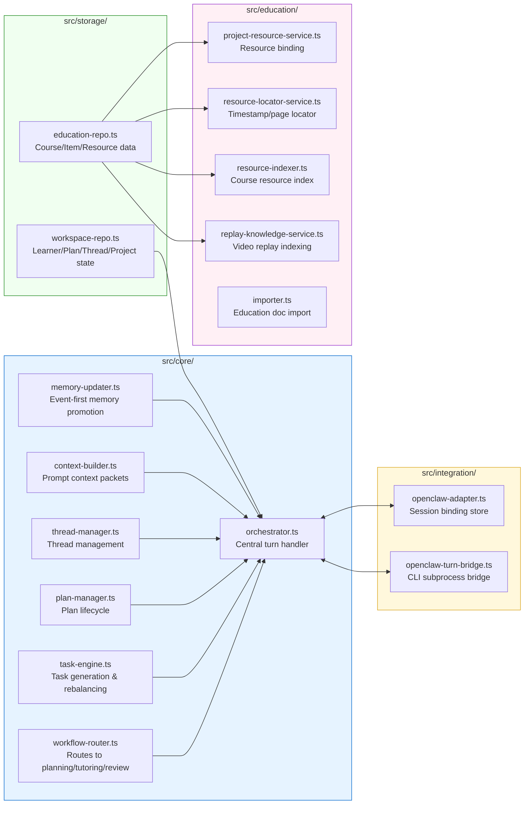
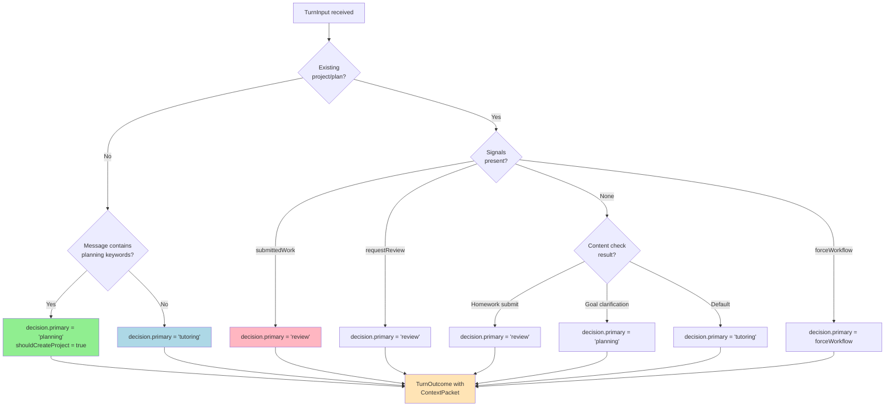
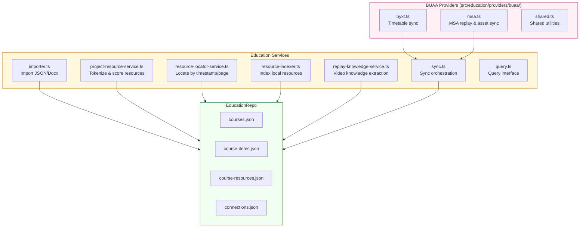
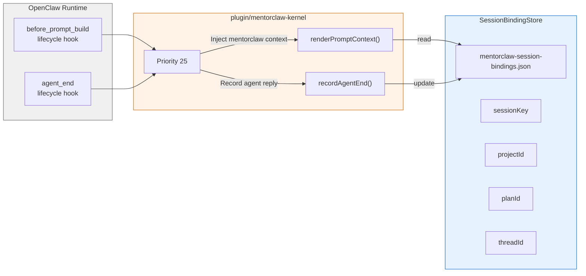
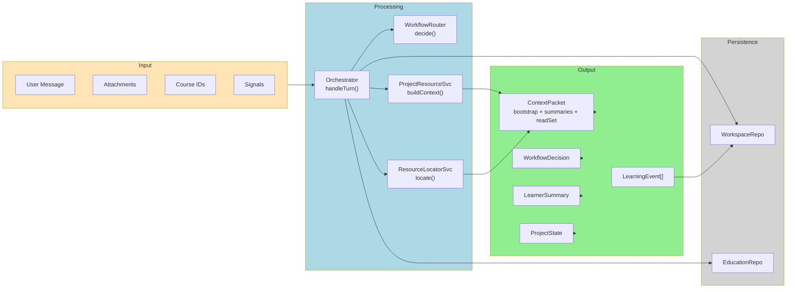

# mentorclaw Architecture Diagrams

> Generated: 2026-04-14

## 1. System Architecture Overview

## 2. Turn Processing Flow

## 3. Core Module Architecture

## 4. Storage Layer Architecture

```mermaid
flowchart TB
    subgraph WorkspaceRepo["WorkspaceRepo"]
        direction TB
        A1["readBootstrap()\nAGENTS.md, SOUL.md, TOOLS.md"]
        A2["readGlobalMemory() / writeGlobalMemory()\nMEMORY.md"]
        A3["readLearnerSummary() / writeLearnerState()\nLEARNER_STATE.yaml"]
        A4["createProject() / readProjectState() / writeProjectState()\nprojects/{id}.yaml"]
        A5["createPlan() / readPlanState() / writePlanState()\nagent/plans/{id}/"]
        A6["createThread() / readThreadState() / writeThreadState()\nagent/plans/{id}/threads/{id}/"]
        A7["appendProjectEvent()\n*.events.jsonl"]
        A8["appendLearnerEvent()\nagent/learner/EVENTS.jsonl"]
    end

    subgraph EducationRepo["EducationRepo"]
        direction TB
        B1["readConnections()\nconnections.json"]
        B2["readCourses() / writeCourses()\ncourses.json"]
        B3["readCourseItems() / writeCourseItems()\ncourse-items.json"]
        B4["readCourseResources() / writeCourseResources()\ncourse-resources.json"]
        B5["readSchedulePreferences()\nschedule-preferences.json"]
    end

    subgraph DataStore["Runtime Filesystem"]
        direction TB
        WS["workspace/\nAGENTS.md, SOUL.md, TOOLS.md\nMEMORY.md\nprojects/, agent/\n.openclaw/"]
        ED["state/education/\ncourses.json\ncourse-items.json\ncourse-resources.json\nconnections.json"]
    end

    WorkspaceRepo --> DataStore
    EducationRepo --> DataStore

    style WorkspaceRepo fill:#e6f3ff,stroke:#0066cc
    style EducationRepo fill:#fff0f5,stroke:#9932cc
    style DataStore fill:#f0f0f0,stroke:#666666
```

## 5. Workflow Routing Decision

## 6. Education Services Architecture

## 7. OpenClaw Plugin Integration

## 8. Data Flow Summary

---

*Generated with Mermaid. Compatible with GitHub, Obsidian, and most markdown renderers.*